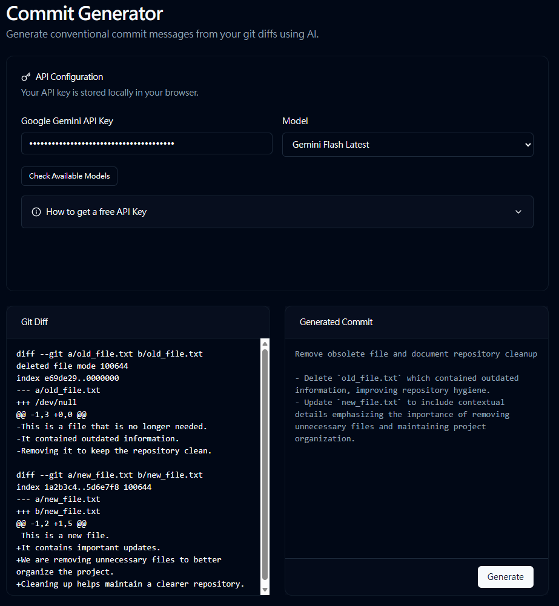
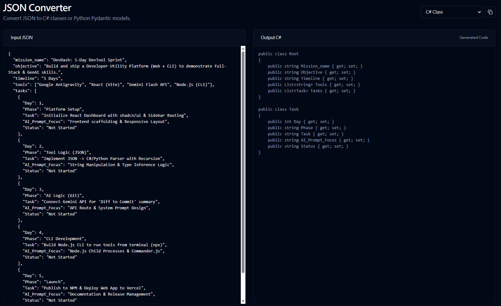
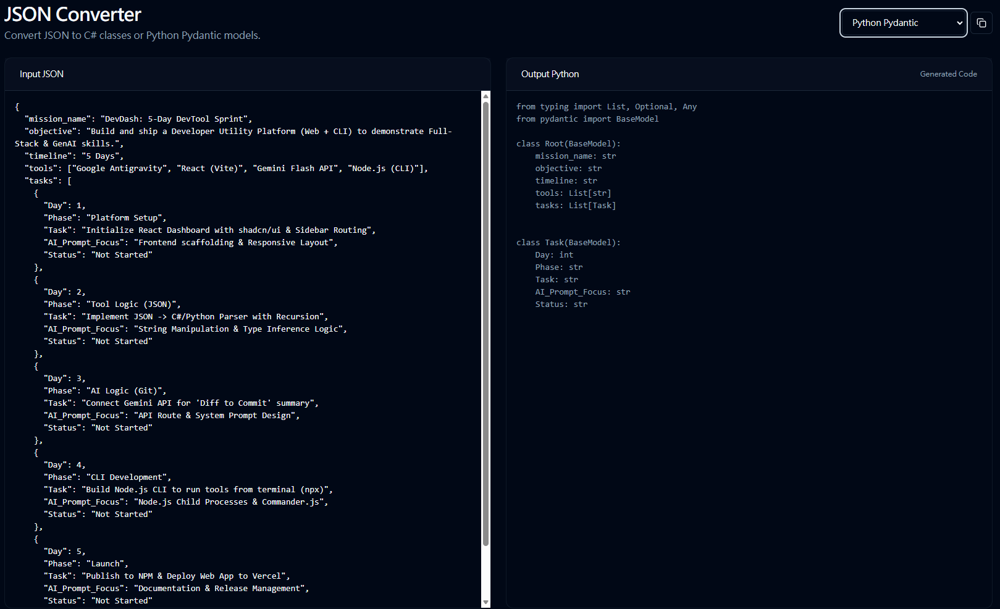
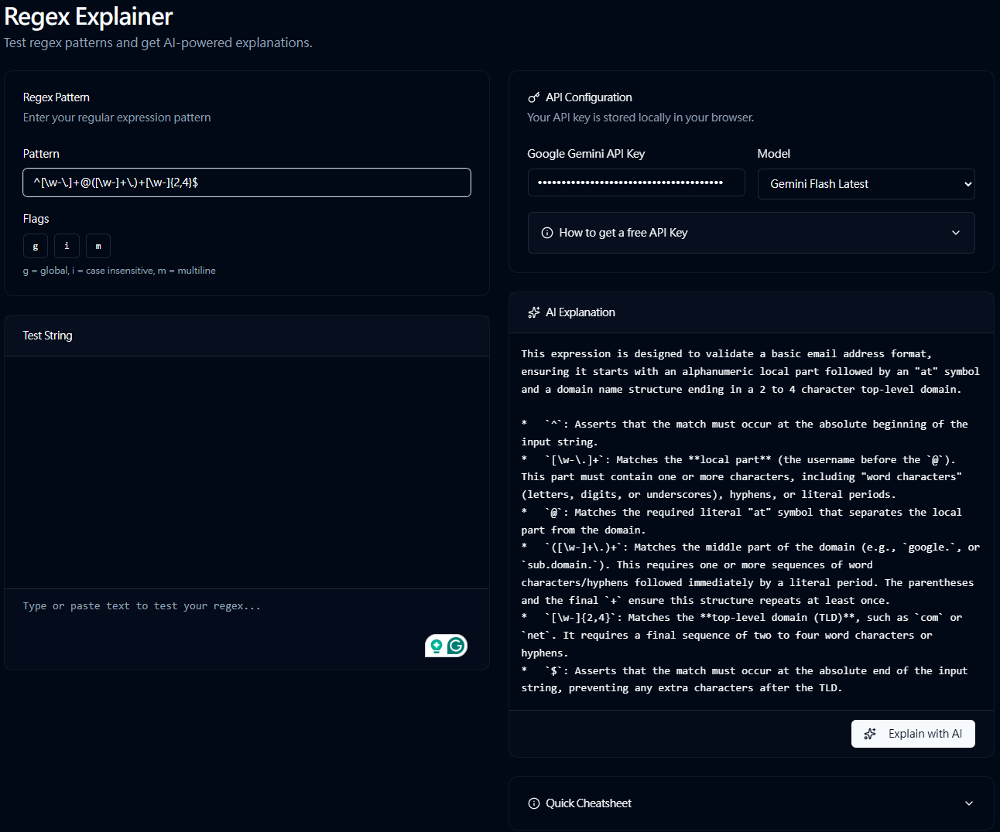
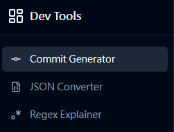

# 🛠️ DevTool Suite

[](https://opensource.org/licenses/MIT)
[](https://www.npmjs.com/package/@pkpkpkddea/devdash)
[](https://reactjs.org/)
[](https://vitejs.dev/)
[](https://deepmind.google/technologies/gemini/)

> **A Swiss Army Knife for modern developers.**  
> Convert JSON to code, generate AI-powered commit messages, and decode regex patterns—all in one privacy-focused dashboard.

---

## ✨ Features

### 🤖 AI Commit Generator
Generate descriptive commit messages from your git diffs using Google's Gemini AI.



- **Smart Analysis**: Analyzes your staged changes and generates meaningful commit messages
- **Detailed Format**: Subject line + bulleted list of changes with explanations
- **Model Selection**: Choose from multiple Gemini models (2.0 Flash, 2.5 Pro, etc.)
- **API Key Management**: Secure local storage of your API key

### 🧬 JSON to Code Converter
Stop writing boilerplate code manually.




- **Instant Parsing**: Paste any JSON object and get ready-to-use class definitions
- **Multi-Language Support**: Generates **C# (POCO)**, **Python (Pydantic)**, and **TypeScript** interfaces
- **Smart Type Inference**: Automatically detects nested objects, lists, and nullable types
- **Copy to Clipboard**: One-click copy of generated code

### 🔍 Regex Explainer
Understand complex regex patterns with AI-powered explanations.



- **Real-time Testing**: Test your regex patterns with live highlighting
- **AI Explanations**: Get plain-English breakdowns of what your pattern does
- **Flag Support**: Toggle global, case-insensitive, and multiline flags
- **Quick Cheatsheet**: Built-in reference for common regex syntax

### 📦 CLI Tool
Install the DevDash CLI for commit message generation from your terminal.

```bash
npm install -g @pkpkpkddea/devdash
```

```bash
# Stage your changes
git add .

# Generate commit message
devdash commit
```

**Features:**
- 🤖 AI-powered commit message generation
- 🔐 Secure API key storage (`~/.devdash/config.json`)
- ⚡ Fast and lightweight
- 🎨 Beautiful terminal output

[View on npm →](https://www.npmjs.com/package/@pkpkpkddea/devdash)

---

## 🛠️ Tech Stack

### Web Dashboard
- **Frontend**: React 19 + Vite
- **Styling**: Tailwind CSS + shadcn/ui
- **AI Integration**: Vercel AI SDK + Google Gemini API
- **Routing**: React Router v7
- **Icons**: Lucide React

### CLI Tool
- **Runtime**: Node.js 18+
- **CLI Framework**: Commander.js
- **AI SDK**: @ai-sdk/google + ai
- **Package**: Published on npm as `@pkpkpkddea/devdash`

---

## 📦 Installation & Setup

### Web Dashboard

```bash
# 1. Clone the repository
git clone https://github.com/pkpkpkddea/DevTool-Suite.git

# 2. Navigate to the dashboard
cd DevTool-Suite/dev-dashboard

# 3. Install dependencies
npm install

# 4. Run the development server
npm run dev
```

The dashboard will be available at `http://localhost:5173`

### CLI Tool

```bash
# Install globally
npm install -g @pkpkpkddea/devdash

# Or use npx (no installation required)
npx @pkpkpkddea/devdash commit
```

---

## 🚀 Usage

### Web Dashboard

1. **Navigate** to the tool you need from the sidebar
2. **Configure** your Google Gemini API key (get one free at [Google AI Studio](https://aistudio.google.com/app/apikey))
3. **Use** the tool:
   - **Commit Generator**: Paste your git diff and click "Generate"
   - **JSON Converter**: Paste JSON, select language, and copy the output
   - **Regex Explainer**: Enter pattern, test string, and get AI explanation

### CLI Tool

```bash
# Generate commit message from staged changes
devdash commit

# Configure API key
devdash config --set-key YOUR_API_KEY

# Change AI model
devdash config --set-model gemini-2.5-pro

# Show current configuration
devdash config --show
```

---

## 🖼️ Screenshots

### Navigation


### Commit Generator


### JSON Converter


### Regex Explainer


---

## 🔑 API Key Setup

All tools use the Google Gemini API. Get your free API key:

1. Visit [Google AI Studio](https://aistudio.google.com/app/apikey)
2. Sign in with your Google account
3. Click "Create API key"
4. Copy the key and paste it in the app

**Privacy**: Your API key is stored locally in your browser's localStorage (web) or in `~/.devdash/config.json` (CLI). It never leaves your machine.

---

## 📝 License

MIT License - see [LICENSE](LICENSE) file for details

---

## 👤 Author

**pkpkpkddea**

- GitHub: [@pkpkpkddea](https://github.com/PKpKDdEa)
- npm: [@pkpkpkddea](https://www.npmjs.com/~pkpkpkddea)

---

## 🤝 Contributing

Contributions, issues, and feature requests are welcome!

1. Fork the repository
2. Create your feature branch (`git checkout -b feature/AmazingFeature`)
3. Commit your changes (`git commit -m 'Add some AmazingFeature'`)
4. Push to the branch (`git push origin feature/AmazingFeature`)
5. Open a Pull Request

---

## ⭐ Show Your Support

Give a ⭐️ if this project helped you!

---

## 📚 Related Links

- [npm Package](https://www.npmjs.com/package/@pkpkpkddea/devdash)
- [Google Gemini API](https://ai.google.dev/)
- [Vercel AI SDK](https://sdk.vercel.ai/)
